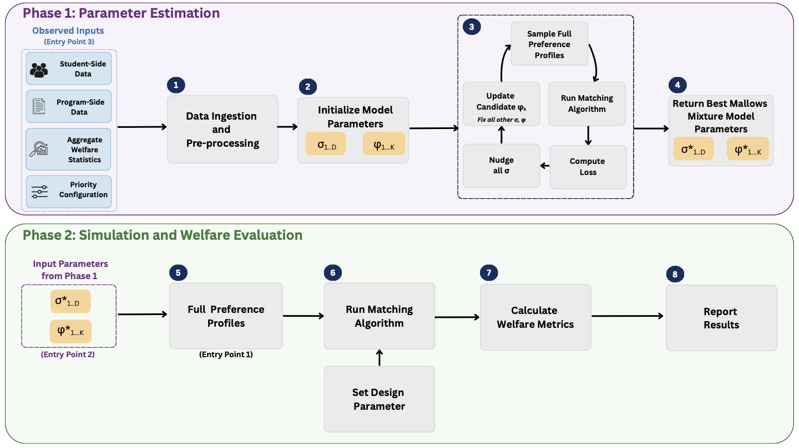

# TRACE: Trade-offs in Rules, Agency, Chance, and Equity

**TRACE** is an open-source computational framework for evaluating welfare trade-offs in centralized school assignment systems. It addresses two core challenges: the scarcity of individual-level student preference data, and the difficulty of counterfactual policy analysis.

TRACE synthesizes individual-level preference profiles from aggregate matching data using mixtures of Mallows models (a family of probabilistic models for ranked preferences) and evaluates welfare across a comprehensive set of metrics. This makes it possible to study, in advance, how design changes to an assignment system (tie-breaking rules, priority structures, list length requirements) affect different groups of students differently. A design choice that reduces unmatched rates may simultaneously lower top-ranked assignment rates for specific subgroups; TRACE makes these trade-offs visible.

---

## How It Works

TRACE operates in two stages.

**1. Preference Inference**

Given aggregate statistics about student applications and match outcomes — such as the fraction of students from each residential district matched to their top-3 or top-5 schools — TRACE fits a K-component Mallows mixture model via an EM algorithm.

Each component of the mixture is defined by a central ranking $\sigma_d$ (a district-level ordering of schools, initialized by revealed preference signals in the aggregate data) and a dispersion parameter $\phi_k \in (0, 1]$ (where $\phi_k$ close to 1 indicates strong concentration around the central ranking). Mixture weights are initialized uniformly.

The EM alternates between:
- **E-step**: sampling synthetic preference lists from the current model and running Deferred Acceptance to produce simulated aggregate statistics
- **M-step**: updating the dispersion parameters $\phi_k$ via gradient ascent to reduce the gap between observed and simulated statistics

Individual submitted list lengths are modeled either from the empirical distribution (when available) or from a clipped Gaussian parameterized by summary statistics. Once a list length $L_i$ is drawn, the full Mallows ranking is truncated to its top $L_i$ entries to form the submitted preference list. Fitted parameters are saved for downstream use.

**2. Counterfactual Welfare Evaluation**

Given fitted parameters, TRACE samples synthetic preference lists, assigns priority attributes and lottery tie-breaking scores, runs Deferred Acceptance under one or more policy configurations, and computes welfare metrics stratified by residential district, borough, or demographic subgroup.

To faithfully represent complex priority systems — including multiple reserve pools, heterogeneous admission methods, and intersecting eligibility categories — TRACE expands each school program into a set of virtual programs, one per seat pool and admission sub-group. Student priority attributes are sampled from distributions calibrated to the observed priority configuration. Each student–program pair is then assigned a composite priority score from reserve bucket, priority tier, and lottery tie-breaker components, and Deferred Acceptance is run over virtual programs before mapping results back to parent programs for welfare evaluation.

Welfare metrics reported by TRACE include rank distributions, top-p match rates (the fraction of students matched to one of their top-p choices), unmatched rates, and school utilization, all stratified by subgroup.

---

## Core Files

These files implement the general-purpose framework and execute in roughly this order:

| File | Role |
|---|---|
| `src/data_ingestion.py` | Loads and preprocesses aggregate application and match data |
| `src/mallows.py` | Mallows model: sampling rankings and computing likelihoods |
| `src/gale_shapley.py` | Student-proposing Deferred Acceptance with configurable priority rules |
| `src/em.py` | EM algorithm: fits a Mallows mixture from aggregate statistics |
| `src/welfare.py` | Computes welfare metrics from simulated match outcomes |
| `src/list_length.py` | Utilities for list length analysis and augmentation |
| `src/util.py` | General shared utilities |
| `src/constants.py` | Geographic and demographic mappings |
| `src/file_config.py` | Path configuration |
| `src/driver.py` | Top-level experiment driver (inference + welfare in one run) |
| `src/parse_validation.py` | Generates validation plots comparing observed vs. simulated statistics across EM iterations |
| `src/plot_validation_scatter.py` | Scatter plots of observed vs. simulated match rates for model fit assessment |
| `src/simulation_validation_analysis.py` | Sensitivity analysis across EM hyperparameters (K, M, iterations) |
| `src/convert_sweep_csv_to_plot.py` | Plots welfare metrics across a counterfactual parameter sweep |
| `src/generate_utilization_from_params.py` | School utilization plots from saved fitted parameters |

---

## System-Specific Files (NYC and Chile)

The following files implement the empirical applications from the paper. A user applying TRACE to a new system would write analogous versions for their own setting.

| File | Role |
|---|---|
| `src/nyc_experiment_driver.py` | End-to-end NYC inference run |
| `src/chilean_experiment_driver.py` | End-to-end Chile inference run |
| `src/nyc_list_len_welfare.py` | Sweeps minimum list length requirements and evaluates welfare effects |
| `src/nyc_priority_attributes.py` | NYC priority attribute counterfactuals (geographic, sibling, etc.) |
| `src/chile_priority_attributes.py` | Chile priority attribute counterfactuals |
| `src/chilean_real_welfare_comparison.py` | Compares welfare under real vs. synthetic preferences for Chile |
| `src/plot_lottery_pure_chance.py` | Welfare under a pure lottery (no preference information) as a lower-bound benchmark |
| `src/DataGeneration/NYC/` | R scripts that process raw NYC DOE data into the format TRACE expects |
| `src/DataGeneration/Chile/` | R scripts that process raw Chilean SAE data |

---

## Data Requirements

TRACE requires aggregate matching statistics organized by student subgroup (e.g., residential district or region). For each subgroup:

- Total number of applicants
- The fraction of applicants who applied to each program, or equivalently the fraction whose top-1, top-2, ..., top-p choice was a given program (used to initialize central rankings $\sigma_d$)
- The fraction matched to their top-1, top-2, ..., top-p choice (the target moments for EM calibration)
- Program-level seat capacities and observed fill rates

These subdivision-level targets ensure the model is calibrated to subgroup-specific outcomes rather than population-level averages alone.

A **priority configuration** (JSON) specifies the school-side priority system: priority tiers, reserve pools and their seat fractions, eligibility criteria, and admission method classifications. See `sample-data/data/nyc_priority_config.json` for a worked example covering NYC's unscreened, screened, EdOpt, and zoned program types.

When priority attribute distributions are needed for counterfactual experiments (e.g., shares of students with sibling priority or disability status), these can be supplied as marginal distributions; TRACE samples individual attributes consistent with them.

The `sample-data/` directory contains processed data for the NYC and Chile applications and serves as a reference for the expected data format.

---

## Dependencies

Python 3.8+ with `numpy`, `pandas`, `scipy`, and `matplotlib`. The data preprocessing pipelines use R.

---

## True Recovered Parameters

| Parameter | Definition / Initialization | Estimated Value | Weight $w_k$ |
|---|---|---|---|
| $\sigma_d$ | Sorted by $\text{Ratio}_{d,j} = T_{d,j}^2 / A_{d,j}$ (descending) | See examples below | --- |
| $\phi_k$ | $\phi_k \sim \max(0.5, \min(\text{Beta}(6,1), 0.99))$ | See estimated values below | $1/6$ (uniform) |
| | **Estimated dispersion parameters** | | |
| $\phi_1$ | | 0.847 | $1/6$ |
| $\phi_2$ | | 0.906 | $1/6$ |
| $\phi_3$ | | 0.935 | $1/6$ |
| $\phi_4$ | | 0.961 | $1/6$ |
| $\phi_5$ | | 0.984 | $1/6$ |
| $\phi_6$ | | 0.985 | $1/6$ |
| | **Example central rankings** | | |
| $\sigma_1$ (District 1) | Bard High School Early College (Prog. 1) | 1st | --- |
| | New Explorations into Science, Technology and Math HS (Prog. 1) | 2nd | --- |
| | East Side Community School (Prog. 1) | 3rd | --- |
| $\sigma_{25}$ (District 25) | Townsend High School (Prog. 1) | 1st | --- |
| | Francis Lewis High School (Prog. 2) | 2nd | --- |
| | Bayside High School (Prog. 5) | 3rd | --- |
| | **Model fit** | | |
| Log-likelihood | | −13,344.96 | |
| MAE, top-3 match rate | | 6.6 pp | |
| MAE, program utilization | | 11.0% | |